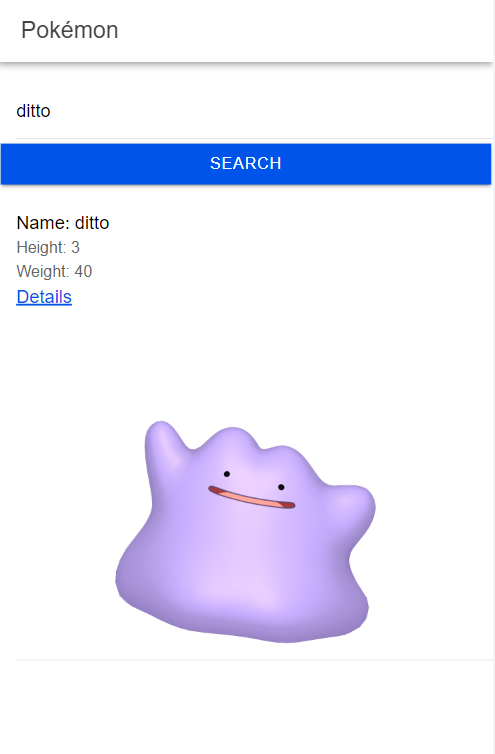
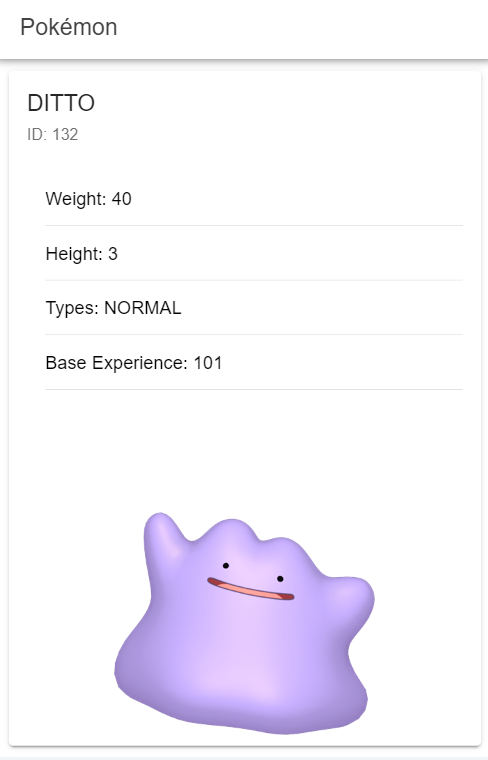

# Pokemon

This project was generated with [Angular Ionic].

## Development server

Run `ionic serve` for a dev server. Navigate to `http://localhost:8100/`. The application will automatically reload if you change any of the source files.

## Home screen

Contains input field to search for the Pokémon by name. Enter the name and click the search button.
Once the search is successful, a link will be displayed to redirect to the Pokémon's details

## Pokemon screen

When loading the page, the Pokémon's data is shown in more detail

